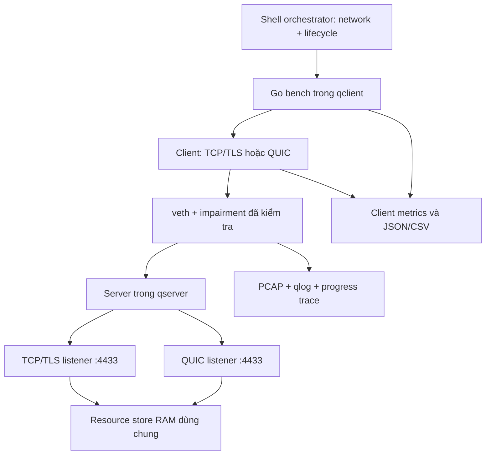

# DEMO_SPEC — QUIC Performance Lab

## 1. Mục tiêu và đầu ra

Xây lab thực nghiệm client/server so sánh **TCP/TLS multiplex trên một connection** với **QUIC nhiều stream trên một connection** dưới cùng workload và network conditions. Chứng minh hoạt động thực, hiểu cơ chế, đo đạc tái lập được và giải thích đúng giới hạn. Đây là phần demo của nhóm 3 người môn Lập trình mạng T03.

Ba demo bắt buộc: A — QUIC dùng UDP; B — full handshake/resumption/0-RTT; C — multiplexing với loss (trọng tâm). Thứ tự live A → C → B → biểu đồ tổng hợp. Tổng live 5–7 phút.

Không xây QUIC/TLS/loss recovery/congestion control từ đầu. Không web app/HTTP/3, không benchmark public Internet, không dùng QUIC DATAGRAM thay reliable streams. Không tự triển khai fallback TCP ngầm khi QUIC thất bại: phải ghi đúng lỗi transport đang thử.

## 2. Kiến trúc

- `cmd/server`: một process, TCP + UDP listeners cùng số port, resources immutable.
- `cmd/client`: một trial; 0-RTT sequence có các connection trong cùng process/cache.
- `cmd/bench`: dùng chung logic client trong `internal/bench`/`internal/transport`; tuần tự tạo fresh connections/trials, không fork server mỗi lần. Không gọi sudo/tc.
- Shell: setup/teardown/netem/capture; namespace entry xong hạ quyền trước khi chạy Go.
- Primary timing chỉ trong client. Server event dùng phân tích tương đối, không tính latency bằng clock khác process.

## 3. Workload và invariant

- Resource IDs 1..6; mặc định 1,048,576 bytes mỗi resource; tổng 6,291,456 bytes.
- Byte ở offset j của resource i: `(i + j) % 256`. Bất biến giữa lần chạy/transport. Không compression.
- Sinh data và SHA-256 ở server trước readiness; client chuẩn bị expected checksums/buffer trước t0. Resource không đọc từ SSD trong measured transfer.
- Chunk 16,384 bytes; chunk cuối có thể ngắn. Profile handshake dùng 1 resource × 1,024 bytes; resource size khác phải restart server đúng profile, không trộn với bulk.
- Client nhận vào buffer có giới hạn. Hash kiểm tra sau khi mọi resource đạt completion; kết quả checksum là điều kiện success.
- Resource count hợp lệ 1..64, size 1..16 MiB, tổng tối đa 64 MiB/trial, chunk 1..64 KiB. Profile chính cố định 6/1 MiB/16 KiB. Từ chối vượt giới hạn trước allocate.
- Server tối đa 8 connections đang xử lý; request-batch deadline 5s, handshake timeout 10s, trial timeout 60s mặc định. Giới hạn testbed, không tuyên bố production hardened.

## 4. Transport

TCP: `net` + `crypto/tls`, TLS1.3, một connection/trial. Server tập hợp request batch rồi single writer interleave round-robin. Client một decoder dispatch theo ResourceID. Không một connection/file; không giữ lock trong toàn bộ download từng resource.

QUIC: quic-go raw transport, một connection/trial và một client-initiated bidirectional stream/resource. Client mở stream theo ResourceID, lưu ID thực, gửi requests mà không đợi response của resource trước. Server accept loop → bounded goroutine/stream. Cùng QB01 response codec. Sau batch-ready, mỗi stream có writer riêng; không global writer/scheduler lock. QUIC scheduling thực tế do thư viện quyết định và được ghi là confounder.

Shared batch barrier chỉ bảo đảm đủ request trước response; không ép ordering giữa các response streams. Tránh scheduler ứng dụng tạo cross-stream HOL phía QUIC.

## 5. TLS và lifecycle

- Cùng certificate/key nhỏ cho hai listeners. SAN chứa `localhost`, `127.0.0.1`, `10.10.0.2`; private key chỉ demo, tạo local và gitignore.
- Client trust explicit local cert/CA, ServerName đúng SAN. TLS1.3 only; ALPN `quicbench/1` giống giữa hai transport.
- TLS cipher thực tế, resumption, QUIC version và congestion config phải được ghi manifest; không nói “fair tuyệt đối” chỉ vì cùng TLS version.
- QUIC v1 cho lab để bám RFC9000; khóa config theo API version thực tế. Không dùng Retry bắt buộc mặc định; ghi cấu hình.
- Server readiness chỉ sau khi store/cert và cả hai sockets sẵn sàng. Shutdown dừng accept, cancel handlers, bounded wait, flush qlog; wrapper chỉ kill process do chính nó tạo.
- Main bulk dùng cold cache từng trial, không 0-RTT. Reuse server process là được, không reuse client connection/cache. Server TLS ticket state giữ ổn định cho 0-RTT sequence.

## 6. 0-RTT

Ba case riêng: cold; resumed nhưng chưa gửi sớm; early có ticket. So early với resumed để tách ảnh hưởng session resumption. Warm-up/cache trong cùng client process, chờ ticket có tín hiệu và deadline, không đo sleep giả định.

Server cần nhận sớm để đọc early requests (ListenEarly + cấu hình Allow0RTT đúng version). Workload chỉ yêu cầu đọc deterministic resource, không có side effect nghiệp vụ. Read-only không loại replay risk của giao thức.

Ghi API enqueue timing, observed handshake completion, actual state Used0RTT/DidResume và evidence packet/qlog. Khi rejected: cancel các early stream workers, một coordinator xử lý chuyển tiếp connection theo API được pin, mở lại stream/request **một lần**, tránh mọi goroutine tự retry tạo trùng. Không tự tính fallback là successful 0-RTT.

## 7. Quan sát và báo cáo

Performance mode: qlog/progress/PCAP tắt; bật log tổng kết sau vùng đo. Evidence mode: bật đồng nhất và tách cohort khỏi performance. Hai CSV chính runs/streams; progress.csv chỉ evidence. Báo cáo gồm summary mean/median/p95/sample stddev, failure rate, chart theo scenario/transport và resource progress. Ghi rõ p95 với 30 mẫu chỉ mô tả mẫu nhỏ.

Bắt buộc đọc các hợp đồng PROTOCOL, METRICS, NETWORK và ACCEPTANCE trước code. Không diễn giải các ví dụ số từ hội thoại như expected output.
