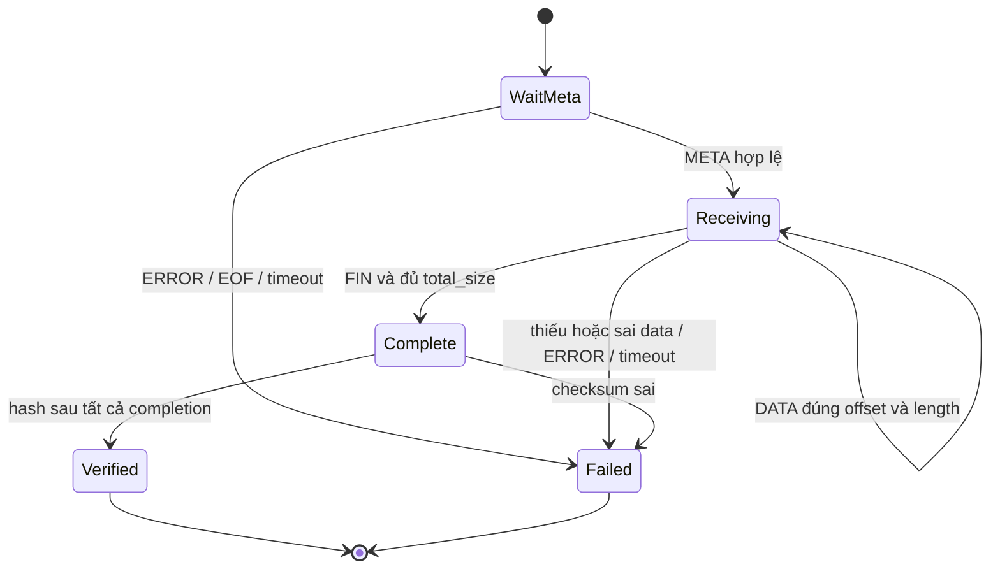

# QB01 — Hợp đồng giao thức ứng dụng

Đây là framing **của lab**, không phải QUIC wire format hay HTTP/2. Cùng codec dùng trên TLS byte stream và từng QUIC stream. Đơn vị application frame không bằng TCP segment, QUIC packet hoặc UDP datagram.

## 1. Header cố định 24 bytes

Tất cả integer không dấu, network byte order (big-endian). Không serialize trực tiếp Go struct vì padding.

| Offset byte | Độ dài | Trường | Giá trị |
|---|---:|---|---|
| 0 | 4 | Magic | ASCII `QB01` |
| 4 | 1 | Type | REQUEST=1, DATA=2, FIN=3, ERROR=4, META=5 |
| 5 | 1 | Flags | 0, bit khác bị từ chối |
| 6 | 2 | Reserved | 0 |
| 8 | 4 | ResourceID | 1..64, thuộc batch |
| 12 | 8 | Offset | Theo type bên dưới |
| 20 | 4 | PayloadLength | Theo type, giới hạn trước allocate |

META=5 là bổ sung của handoff để mô tả kích thước/hash trước data; giữ nguyên số 1..4 đã đề xuất.

## 2. Payload và semantics

| Type | Offset | PayloadLength | Payload |
|---|---|---:|---|
| REQUEST | 0 | 8 | uint32 batch_count + uint32 chunk_bytes |
| META | 0 | 40 | uint64 total_size + 32 raw bytes SHA-256 |
| DATA | Offset kế tiếp của resource | 1..chunk_bytes | Resource bytes |
| FIN | total_size | 0 | Rỗng |
| ERROR | 0 | 2..258 | uint16 error_code + tối đa 256 bytes UTF-8 message |

Resource count và chunk của tất cả REQUEST trong cùng batch phải giống nhau. IDs yêu cầu đúng tập 1..N trong lab v1. Không có run_id/timestamp trong header; correlation nằm ở log/manifest. Server chỉ chấp nhận một batch/connection. Size mỗi resource do cấu hình server, META trả size; client đối chiếu với profile đã yêu cầu khi khởi chạy. Mismatch fail, không silently resize để hợp thức hóa khác workload.

Error codes: 1 malformed; 2 unknown resource; 3 invalid batch; 4 limit exceeded; 5 internal error; 6 batch timeout. Header không tin cậy/magic sai/length quá lớn → đóng connection (TCP) hoặc kết thúc trial QUIC, không đọc length tùy ý để “skip”. Best-effort ERROR chỉ khi còn định danh frame an toàn. EOF sau dữ liệu thiếu FIN là lỗi.

## 3. Request batch

Client gửi N REQUEST theo ResourceID tăng dần, không đợi response từng resource. TCP single request writer; QUIC mở N streams theo thứ tự rồi gửi request trên từng stream; không chờ stream trước hoàn tất. Nếu mở/gửi thất bại, cancel toàn trial.

Server đọc/validate đủ N requests rồi signal batch-ready. Barrier deadline 5s bắt đầu từ REQUEST hợp lệ đầu tiên; connection deadline bao phủ cả việc không gửi request. Duplicate ID, số count không nhất quán, N vượt limit hoặc stream/request thiếu → fail trial. Không chờ vô hạn.

Connection lifetime: connection chỉ nhận một batch, giới hạn deadline cả quá trình. Sau N valid requests, coordinator đóng registration; request/stream thừa gây protocol failure. Mọi lỗi validation phải cancel coordinator và đánh thức workers đang đợi, không chỉ return ở worker lỗi. Giới hạn concurrency tránh peer mở stream vô hạn.

QUIC: N workers cùng đăng ký vào per-connection batch coordinator; **không** giữ mutex khi chờ readiness hoặc khi Write response. Accept loop tiếp tục nhận streams trong khi các worker đợi. Sau request, client Close send-half; server xác nhận không có request thứ hai và dùng deadline khi kiểm tra EOF. Việc đóng send-half không đóng receive-half.

TCP: requests có boundary riêng nên không chờ EOF của connection để bắt đầu response; connection còn dùng hai chiều. Có thể reader/writer độc lập nhưng không có nhiều writers trên cùng direction. Không bắt buộc CloseWrite để signal end-of-batch; N là boundary.

## 4. Response state machine mỗi resource

Một META rồi 1+ DATA rồi đúng một FIN (resource size >0). Offset đầu 0, kế tiếp bằng tổng DATA trước đó. DATA vượt size, offset trùng/lùi/nhảy, META/FIN lặp, DATA sau FIN hoặc ResourceID sai stream → protocol error. Không “sửa” offset bằng append.

Client lưu metadata, nhận vào đúng buffer, ghi first byte khi Read đầu tiên trả n>0 của DATA payload, complete sau FIN hợp lệ. Ghi payload_done riêng khi đủ bytes. QUIC stream EOF mong đợi sau FIN, đọc/đóng có deadline trong cleanup; EOF thiếu FIN là failure. TCP connection đóng sau toàn batch; không dùng connection EOF làm completion của từng resource.

Nếu lỗi một resource, toàn trial `success=false`; giữ những row resource đã hoàn tất và error cho resource còn lại. Cancel đọc/ghi còn treo. Checksum lỗi sau timing vẫn làm trial fail và loại khỏi successful latency aggregate, nhưng vẫn giữ raw record.

## 5. TCP scheduler

Sau đủ requests: ghi META cho tất cả IDs theo thứ tự; tiếp đó mỗi vòng ghi tối đa một DATA chunk cho từng resource còn dữ liệu; FIN ngay sau DATA cuối của resource đó. Vòng kế tiếp bỏ ID đã FIN. Một writer sở hữu conn từ đầu tới cuối. Có thể sinh frames trực tiếp từ immutable RAM store; không bắt buộc tạo producer queues vì chưa cần disk/streaming producers.

Không Write toàn file trong một lượt rồi chuyển resource; không mỗi goroutine tự Write header/payload trên shared conn. Một writeAll helper lặp đến đủ n hoặc error, xử lý n=0,nil thành no-progress error. Header/payload phải được writer duy nhất serialize liền nhau. `bufio.Writer` nếu dùng phải flush có chủ đích, không giữ tới cuối batch; baseline ưu tiên không thêm buffer ngoài TLS để semantics rõ.

## 6. QUIC mapping

Một ResourceID ↔ một stream thực tế; native stream ID được ghi log. Client-initiated bidirectional IDs thường 0,4,8,... nhưng không dùng phép chia 4 để suy ra ResourceID. Không tạo control stream mà không cập nhật contract/metrics.

Mỗi response stream gửi META → DATA* → FIN → Close send-half. Close của send side chỉ kết thúc gửi, không chứng minh peer đã nhận đủ. Client là nơi xác nhận completion. Batch coordinator chỉ chặn trước response; sau đó mỗi stream chạy độc lập. Thư viện chia/coalesce frame/packet theo cách riêng; không được nói chunk 16KiB là một packet.

## 7. Robustness tests bắt buộc

- Header golden vector 24 bytes; roundtrip META/request; checksum encoding raw, không hex 64 bytes trong META.
- Reader trả 1–7 bytes/lần; gộp nhiều frames; payload/header bị cắt; writer short-write/no-progress.
- Bad magic/type/flags/reserved; payload >limit; count=0/65; chunk=0/65537; tổng resource >64MiB.
- Sai ResourceID/offset/size; duplicate request/FIN; EOF trước FIN; cancellation giải phóng handlers.
- Interleaving TCP được chứng minh ở scheduler test bằng thứ tự frames, không bằng giả định số TCP packet.
- QUIC không serial download N resources; request batch/barrier không deadlock; close/reset không leak.
- Fuzz parser có bound memory; regression tests cho lỗi tìm được. Không fuzz network benchmark như một kết luận hiệu năng.
